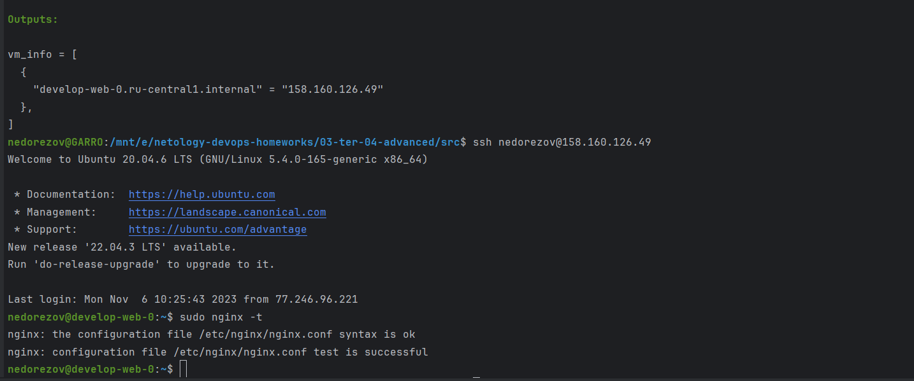
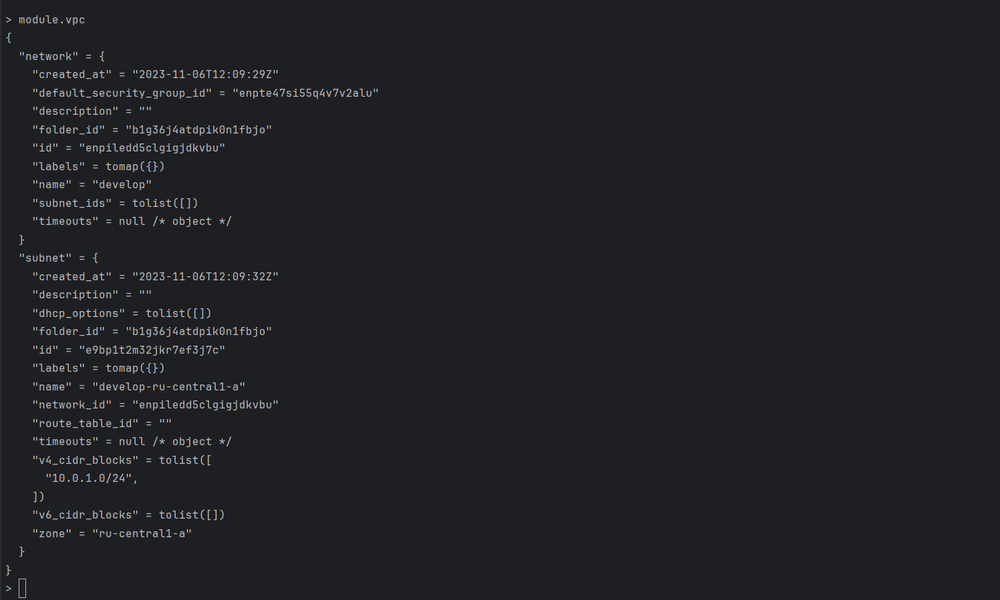
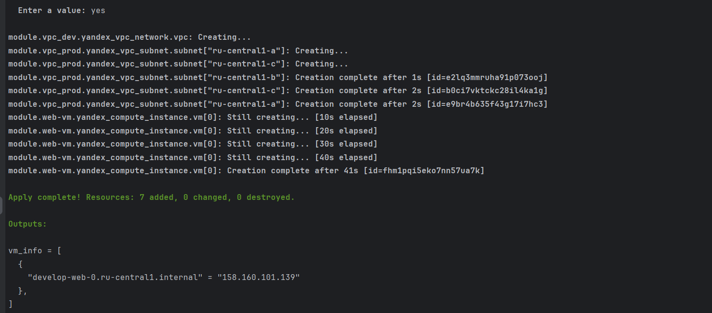
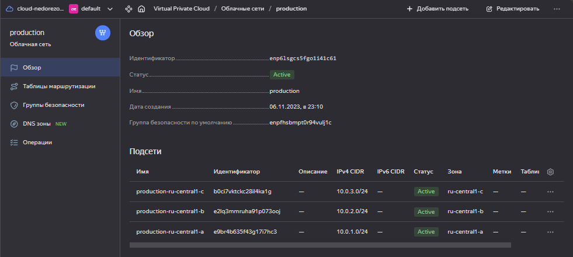
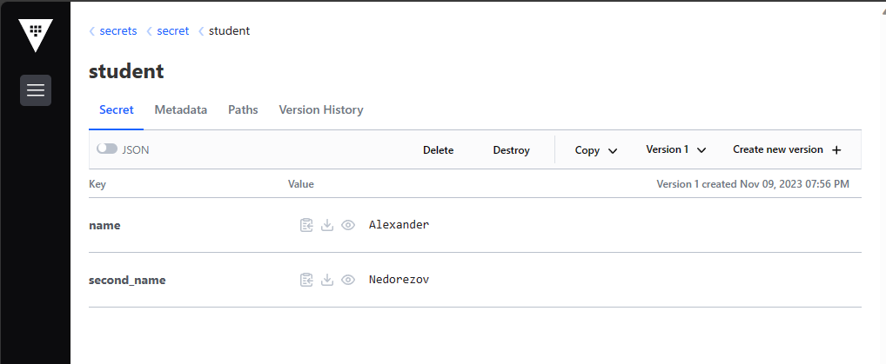

# Домашнее задание к занятию "Продвинутые методы работы с Terraform"


------

## Задание 1
1. Возьмите из [демонстрации к лекции готовый код](https://github.com/netology-code/ter-homeworks/tree/main/04/demonstration1) для создания ВМ с помощью remote-модуля.
2. Создайте одну ВМ, используя этот модуль. В файле cloud-init.yml необходимо использовать переменную для ssh-ключа вместо хардкода. Передайте ssh-ключ в функцию template_file в блоке vars ={} .
Воспользуйтесь [**примером**](https://grantorchard.com/dynamic-cloudinit-content-with-terraform-file-templates/). Обратите внимание, что ssh-authorized-keys принимает в себя список, а не строку.
3. Добавьте в файл cloud-init.yml установку nginx.
4. Предоставьте скриншот подключения к консоли и вывод команды ```sudo nginx -t```.


> ### Ответ:
> В [variables.tf](src/variables.tf) объявил переменные `username`, `ssh_public_key` и список пакетов для установки `web_packages` (куда и добавил nginx).
> 
> Для cloudinit в `template_file` добавил vars:
> ```terraform
> data "template_file" "web_cloudinit" {
>   template = file("./cloud-init.yml")
>   vars = {
>     username       = var.username
>     ssh_public_key = file(var.ssh_public_key)
>     packages       = jsonencode(var.web_packages)
>   }
> }
> ```
> 
> В [outputs.tf](src/outputs.tf) добавил вывод информации из outputs модуля:
> ```terraform
> output "vm_info" {
>   value = flatten([
>     for i, v in module.web-vm.external_ip_address : {
>       module.web-vm.fqdn[i] = v
>     }
>   ])
> }
> ```
> 
> Подключился к ВМ, выполнил тест конфигурации:
> 

------

## Задача 2
1. Напишите локальный модуль vpc, который будет создавать 2 ресурса: **одну** сеть и **одну** подсеть в зоне, объявленной при вызове модуля, например: ```ru-central1-a```.
2. Вы должны передать в модуль переменные с названием сети, zone и v4_cidr_blocks.
3. Модуль должен возвращать в root module с помощью output информацию о yandex_vpc_subnet. Пришлите скриншот информации из terraform console о своем модуле. Пример: > module.vpc_dev  
4. Замените ресурсы yandex_vpc_network и yandex_vpc_subnet созданным модулем. Не забудьте передать необходимые параметры сети из модуля vpc в модуль с виртуальной машиной.
5. Откройте terraform console и предоставьте скриншот содержимого модуля. Пример: > module.vpc_dev.
6. Сгенерируйте документацию к модулю с помощью terraform-docs.


> ### Ответ:
> Написал модуль [vpc](src/vpc), в [main.tf](src/main.tf) добавил вызов модуля, а также в вызове `web-vm` переопределил использование `network_id` и `subnet_ids` на модуль.  В `outputs` выводит информацию о сети и подсети, проверил в консоли через `module.vpc`: 
> 
> 
> Выполнил `terraform plan` + `terraform apply`, из консоли проверил содержимое модуля:
> 
> 
> Как выглядит информация модуля из консоли `module.vpc`:
> 
> 
> Сгенерировал документацию с помощью `terraform-docs`, расположена в [src/vpc/README.md](src/vpc/README.md)
> ```shell
> terraform-docs markdown ./vpc > ./vpc/README.md
> ```
>

------

## Задача 3
1. Выведите список ресурсов в стейте.
2. Полностью удалите из стейта модуль vpc.
3. Полностью удалите из стейта модуль vm.
4. Импортируйте всё обратно. Проверьте terraform plan. Изменений быть не должно.
Приложите список выполненных команд и скриншоты процессы.

> ### Ответ:
> Список ресурсов в стейте: ``` terraform state list ```
> 
> 
> 
> Удалил из стейта модуль vpc: ``` terraform state rm module.vpc ```
> 
> Удалил из стейта модуль vm: ``` terraform state rm module.web-vm ```
> 
> 
> 
> Выполнил импорт обратно: 
> ```shell
> terraform import module.vpc.yandex_vpc_network.vpc enpiledd5clgigjdkvbu
> terraform import module.vpc.yandex_vpc_subnet.subnet e9bp1t2m32jkr7ef3j7c
> terraform import module.web-vm.yandex_compute_instance.vm[0] fhmn812ie1mt6a97u9qd
> ```
> Скриншот импорта на примере ВМ:
> 
> 
> В результате при выполнении `terraform plan` почему-то все равно есть изменение, в ВМ добавляется `+ allow_stopping_for_update = true`. 
> 
> Т.е. при импорте в файле `terraform.tfstate` у инстанса указан `"allow_stopping_for_update": null,`. Вероятно, наткнулся на баг (или фичу?) версии Terraform или провайдера.
> Для подтверждения приложил полный лог консоли:
> 
> <details>
>   <summary>Console log</summary>
>
> ```shell
> nedorezov@GARRO:/mnt/e/netology-devops-homeworks/03-ter-04-advanced/src$ terraform state rm module.vpc
> Removed module.vpc.yandex_vpc_network.vpc
> Removed module.vpc.yandex_vpc_subnet.subnet
> Successfully removed 2 resource instance(s).
> nedorezov@GARRO:/mnt/e/netology-devops-homeworks/03-ter-04-advanced/src$ terraform state rm module.web-vm
> Removed module.web-vm.data.yandex_compute_image.my_image
> Removed module.web-vm.yandex_compute_instance.vm[0]
> Successfully removed 2 resource instance(s).
> nedorezov@GARRO:/mnt/e/netology-devops-homeworks/03-ter-04-advanced/src$ terraform state list
> data.template_file.web_cloudinit
> nedorezov@GARRO:/mnt/e/netology-devops-homeworks/03-ter-04-advanced/src$ terraform import module.vpc.yandex_vpc_network.vpc enpiledd5clgigjdkvbu
> module.vpc.yandex_vpc_network.vpc: Importing from ID "enpiledd5clgigjdkvbu"...
> module.web-vm.data.yandex_compute_image.my_image: Reading...
> module.vpc.yandex_vpc_network.vpc: Import prepared!
>   Prepared yandex_vpc_network for import
> module.vpc.yandex_vpc_network.vpc: Refreshing state... [id=enpiledd5clgigjdkvbu]
> data.template_file.web_cloudinit: Reading...
> data.template_file.web_cloudinit: Read complete after 0s [id=2c384563b1230d3a4ea15c35848a87a0cd061a07a53e3434513636ff896da271]
> module.web-vm.data.yandex_compute_image.my_image: Read complete after 3s [id=fd8pf6624ff60n2pa1qk]
> 
> Import successful!
> 
> The resources that were imported are shown above. These resources are now in
> your Terraform state and will henceforth be managed by Terraform.
> 
> 
> nedorezov@GARRO:/mnt/e/netology-devops-homeworks/03-ter-04-advanced/src$ terraform import module.vpc.yandex_vpc_subnet.subnet e9bp1t2m32jkr7ef3j7c
> data.template_file.web_cloudinit: Reading...
> data.template_file.web_cloudinit: Read complete after 0s [id=2c384563b1230d3a4ea15c35848a87a0cd061a07a53e3434513636ff896da271]
> module.web-vm.data.yandex_compute_image.my_image: Reading...
> module.vpc.yandex_vpc_subnet.subnet: Importing from ID "e9bp1t2m32jkr7ef3j7c"...
> module.vpc.yandex_vpc_subnet.subnet: Import prepared!
>   Prepared yandex_vpc_subnet for import
> module.vpc.yandex_vpc_subnet.subnet: Refreshing state... [id=e9bp1t2m32jkr7ef3j7c]
> module.web-vm.data.yandex_compute_image.my_image: Read complete after 3s [id=fd8pf6624ff60n2pa1qk]
> 
> Import successful!
> 
> The resources that were imported are shown above. These resources are now in
> your Terraform state and will henceforth be managed by Terraform.
> 
> 
> nedorezov@GARRO:/mnt/e/netology-devops-homeworks/03-ter-04-advanced/src$ terraform import module.web-vm.yandex_compute_instance.vm[0] fhmn812ie1mt6a97u9qd
> data.template_file.web_cloudinit: Reading...
> data.template_file.web_cloudinit: Read complete after 0s [id=2c384563b1230d3a4ea15c35848a87a0cd061a07a53e3434513636ff896da271]
> module.web-vm.data.yandex_compute_image.my_image: Reading...
> module.web-vm.data.yandex_compute_image.my_image: Read complete after 3s [id=fd8pf6624ff60n2pa1qk]
> module.web-vm.yandex_compute_instance.vm[0]: Importing from ID "fhmn812ie1mt6a97u9qd"...
> module.web-vm.yandex_compute_instance.vm[0]: Import prepared!
>   Prepared yandex_compute_instance for import
> module.web-vm.yandex_compute_instance.vm[0]: Refreshing state... [id=fhmn812ie1mt6a97u9qd]
> 
> Import successful!
> 
> The resources that were imported are shown above. These resources are now in
> your Terraform state and will henceforth be managed by Terraform.
> 
> nedorezov@GARRO:/mnt/e/netology-devops-homeworks/03-ter-04-advanced/src$ terraform plan
> module.web-vm.data.yandex_compute_image.my_image: Reading...
> module.vpc.yandex_vpc_network.vpc: Refreshing state... [id=enpiledd5clgigjdkvbu]
> data.template_file.web_cloudinit: Reading...
> data.template_file.web_cloudinit: Read complete after 0s [id=2c384563b1230d3a4ea15c35848a87a0cd061a07a53e3434513636ff896da271]
> module.web-vm.data.yandex_compute_image.my_image: Read complete after 3s [id=fd8pf6624ff60n2pa1qk]
> module.vpc.yandex_vpc_subnet.subnet: Refreshing state... [id=e9bp1t2m32jkr7ef3j7c]
> module.web-vm.yandex_compute_instance.vm[0]: Refreshing state... [id=fhmn812ie1mt6a97u9qd]
> 
> Terraform used the selected providers to generate the following execution plan. Resource actions are indicated with the following symbols:
>   ~ update in-place
> 
> Terraform will perform the following actions:
> 
>   # module.web-vm.yandex_compute_instance.vm[0] will be updated in-place
>   ~ resource "yandex_compute_instance" "vm" {
>       + allow_stopping_for_update = true
>         id                        = "fhmn812ie1mt6a97u9qd"
>         name                      = "develop-web-0"
>         # (11 unchanged attributes hidden)
> 
>         # (6 unchanged blocks hidden)
>     }
> 
> Plan: 0 to add, 1 to change, 0 to destroy.
> 
> ─────────────────────────────────────────────────────────────────────────────────────────────────────────────────────────────────────────────────────────────────────────────────────────────────────────────────────────────────────────────────────────────────────────────────────────────────────────────────────────────────────────────────────────────────────────────────── 
> 
> Note: You didn't use the -out option to save this plan, so Terraform can't guarantee to take exactly these actions if you run "terraform apply" now.
> nedorezov@GARRO:/mnt/e/netology-devops-homeworks/03-ter-04-advanced/src$
> 
> ```
>
> </details>


------

## Задача 4*
1. Измените модуль vpc так, чтобы он мог создать подсети во всех зонах доступности, переданных в переменной типа list(object) при вызове модуля.  
  
Пример вызова
```
module "vpc_prod" {
  source       = "./vpc"
  env_name     = "production"
  subnets = [
    { zone = "ru-central1-a", cidr = "10.0.1.0/24" },
    { zone = "ru-central1-b", cidr = "10.0.2.0/24" },
    { zone = "ru-central1-c", cidr = "10.0.3.0/24" },
  ]
}

module "vpc_dev" {
  source       = "./vpc"
  env_name     = "develop"
  subnets = [
    { zone = "ru-central1-a", cidr = "10.0.1.0/24" },
  ]
}
```

Предоставьте код, план выполнения, результат из консоли YC.


> ### Ответ:
> Обновил `vpc` модуль:
> - [vpc/variables.tf](src/vpc/variables.tf) - вместо переменных `zone` и `cidr` добавил составную `subnets`
> - [vpc/main.tf](src/vpc/main.tf) - добавил `for_each` в yandex_vpc_subnet
> 
> В основном файле [main.tf](src/main.tf) заменил вызов модуля на `vpc_dev` и `vpc_prod` с разными параметрами, также ВМ добавил в новую сеть dev-окружения.
>
> 
> Обновил документацию: [vpc/README-4task.md](src/vpc/README-4task.md)
> 
> Результат `terraform apply`:
> 
> 
> В консоли YC:
> 
> 
> 
> 
> <details>
>   <summary>План выполнения:</summary>
> 
> ```shell
> nedorezov@GARRO:/mnt/e/netology-devops-homeworks/03-ter-04-advanced/src$ terraform plan
> data.template_file.web_cloudinit: Reading...
> data.template_file.web_cloudinit: Read complete after 0s [id=2c384563b1230d3a4ea15c35848a87a0cd061a07a53e3434513636ff896da271]
> module.web-vm.data.yandex_compute_image.my_image: Reading...
> module.web-vm.data.yandex_compute_image.my_image: Read complete after 3s [id=fd8pf6624ff60n2pa1qk]
> 
> Terraform used the selected providers to generate the following execution plan. Resource actions are indicated with the following symbols:
>   + create
> 
> Terraform will perform the following actions:
> 
>   # module.vpc_dev.yandex_vpc_network.vpc will be created
>   + resource "yandex_vpc_network" "vpc" {
>       + created_at                = (known after apply)
>       + default_security_group_id = (known after apply)
>       + folder_id                 = (known after apply)
>       + id                        = (known after apply)
>       + labels                    = (known after apply)
>       + name                      = "develop"
>       + subnet_ids                = (known after apply)
>     }
> 
>   # module.vpc_dev.yandex_vpc_subnet.subnet["ru-central1-a"] will be created
>   + resource "yandex_vpc_subnet" "subnet" {
>       + created_at     = (known after apply)
>       + folder_id      = (known after apply)
>       + id             = (known after apply)
>       + labels         = (known after apply)
>       + name           = "develop-ru-central1-a"
>       + network_id     = (known after apply)
>       + v4_cidr_blocks = [
>           + "10.0.10.0/24",
>         ]
>       + v6_cidr_blocks = (known after apply)
>       + zone           = "ru-central1-a"
>     }
> 
>   # module.vpc_prod.yandex_vpc_network.vpc will be created
>   + resource "yandex_vpc_network" "vpc" {
>       + created_at                = (known after apply)
>       + default_security_group_id = (known after apply)
>       + folder_id                 = (known after apply)
>       + id                        = (known after apply)
>       + labels                    = (known after apply)
>       + name                      = "production"
>       + subnet_ids                = (known after apply)
>     }
> 
>   # module.vpc_prod.yandex_vpc_subnet.subnet["ru-central1-a"] will be created
>   + resource "yandex_vpc_subnet" "subnet" {
>       + created_at     = (known after apply)
>       + folder_id      = (known after apply)
>       + id             = (known after apply)
>       + labels         = (known after apply)
>       + name           = "production-ru-central1-a"
>       + network_id     = (known after apply)
>       + v4_cidr_blocks = [
>           + "10.0.1.0/24",
>         ]
>       + v6_cidr_blocks = (known after apply)
>       + zone           = "ru-central1-a"
>     }
> 
>   # module.vpc_prod.yandex_vpc_subnet.subnet["ru-central1-b"] will be created
>   + resource "yandex_vpc_subnet" "subnet" {
>       + created_at     = (known after apply)
>       + folder_id      = (known after apply)
>       + id             = (known after apply)
>       + labels         = (known after apply)
>       + name           = "production-ru-central1-b"
>       + network_id     = (known after apply)
>       + v4_cidr_blocks = [
>           + "10.0.2.0/24",
>         ]
>       + v6_cidr_blocks = (known after apply)
>       + zone           = "ru-central1-b"
>     }
> 
>   # module.vpc_prod.yandex_vpc_subnet.subnet["ru-central1-c"] will be created
>   + resource "yandex_vpc_subnet" "subnet" {
>       + created_at     = (known after apply)
>       + folder_id      = (known after apply)
>       + id             = (known after apply)
>       + labels         = (known after apply)
>       + name           = "production-ru-central1-c"
>       + network_id     = (known after apply)
>       + v4_cidr_blocks = [
>           + "10.0.3.0/24",
>         ]
>       + v6_cidr_blocks = (known after apply)
>       + zone           = "ru-central1-c"
>     }
> 
>   # module.web-vm.yandex_compute_instance.vm[0] will be created
>   + resource "yandex_compute_instance" "vm" {
>       + allow_stopping_for_update = true
>       + created_at                = (known after apply)
>       + description               = "TODO: description; {{terraform managed}}"
>       + folder_id                 = (known after apply)
>       + fqdn                      = (known after apply)
>       + gpu_cluster_id            = (known after apply)
>       + hostname                  = "develop-web-0"
>       + id                        = (known after apply)
>       + labels                    = {
>           + "env"     = "develop"
>           + "project" = "undefined"
>         }
>       + metadata                  = {
>           + "serial-port-enable" = "1"
>           + "user-data"          = <<-EOT
>                 #cloud-config
>                 users:
>                   - name: nedorezov
>                     groups: sudo
>                     shell: /bin/bash
>                     sudo: ['ALL=(ALL) NOPASSWD:ALL']
>                     ssh_authorized_keys:
>                       - ssh-ed25519 AAAAC3NzaC1lZDI1NTE5AAAAIKWdwZ3ITR9ceNI5R/BcOHUf9H3G/i/u2MkOGk945cUI nedorezov@GARRO
> 
>                 package_update: true
>                 package_upgrade: false
>                 packages: ["vim","nginx"]
>             EOT
>         }
>       + name                      = "develop-web-0"
>       + network_acceleration_type = "standard"
>       + platform_id               = "standard-v1"
>       + service_account_id        = (known after apply)
>       + status                    = (known after apply)
>       + zone                      = "ru-central1-a"
> 
>       + boot_disk {
>           + auto_delete = true
>           + device_name = (known after apply)
>           + disk_id     = (known after apply)
>           + mode        = (known after apply)
> 
>           + initialize_params {
>               + block_size  = (known after apply)
>               + description = (known after apply)
>               + image_id    = "fd8pf6624ff60n2pa1qk"
>               + name        = (known after apply)
>               + size        = 10
>               + snapshot_id = (known after apply)
>               + type        = "network-hdd"
>             }
>         }
> 
>       + network_interface {
>           + index              = (known after apply)
>           + ip_address         = (known after apply)
>           + ipv4               = true
>           + ipv6               = (known after apply)
>           + ipv6_address       = (known after apply)
>           + mac_address        = (known after apply)
>           + nat                = true
>           + nat_ip_address     = (known after apply)
>           + nat_ip_version     = (known after apply)
>           + security_group_ids = (known after apply)
>           + subnet_id          = (known after apply)
>         }
> 
>       + resources {
>           + core_fraction = 5
>           + cores         = 2
>           + memory        = 1
>         }
> 
>       + scheduling_policy {
>           + preemptible = true
>         }
>     }
> 
> Plan: 7 to add, 0 to change, 0 to destroy.
> 
> Changes to Outputs:
>   + vm_info = (known after apply)
> ```
> </details>

------

## Задача 5*
1. Напишите модуль для создания кластера managed БД Mysql в Yandex Cloud с одним или несколькими(2 по умолчанию) хостами в зависимости от переменной HA=true или HA=false. Используйте ресурс yandex_mdb_mysql_cluster: передайте имя кластера и id сети.
2. Напишите модуль для создания базы данных и пользователя в уже существующем кластере managed БД Mysql. Используйте ресурсы yandex_mdb_mysql_database и yandex_mdb_mysql_user: передайте имя базы данных, имя пользователя и id кластера при вызове модуля.
3. Используя оба модуля, создайте кластер example из одного хоста, а затем добавьте в него БД test и пользователя app. Затем измените переменную и превратите сингл хост в кластер из 2-х серверов.
4. Предоставьте план выполнения и по возможности результат. Сразу же удаляйте созданные ресурсы, так как кластер может стоить очень дорого. Используйте минимальную конфигурацию.

> ### Ответ:
> Создал модуль [src/mysql](src/mysql) для создания кластера, документация: [README.md](src/mysql/README.md)
> 
> Создал модуль [src/database](src/database) для создания БД и пользователя, документация: [README.md](src/database/README.md)
> 
> Сначала создадим кластер с `HA = false`: 
> 
> <details>
>   <summary>План выполнения:</summary>
> 
> ```shell
> nedorezov@GARRO:/mnt/e/netology-devops-homeworks/03-ter-04-advanced/src$ terraform plan
> data.template_file.web_cloudinit: Reading...
> data.template_file.web_cloudinit: Read complete after 0s [id=2c384563b1230d3a4ea15c35848a87a0cd061a07a53e3434513636ff896da271]
> module.web-vm.data.yandex_compute_image.my_image: Reading...
> module.vpc_dev.yandex_vpc_network.vpc: Refreshing state... [id=enp9101u6ihqk1s6u77c]
> module.vpc_prod.yandex_vpc_network.vpc: Refreshing state... [id=enp0uboqekbphkjg3vnh]
> module.web-vm.data.yandex_compute_image.my_image: Read complete after 2s [id=fd8pf6624ff60n2pa1qk]
> module.vpc_prod.yandex_vpc_subnet.subnet["ru-central1-b"]: Refreshing state... [id=e2lh4n2397g3qkj3q13l]
> module.vpc_prod.yandex_vpc_subnet.subnet["ru-central1-a"]: Refreshing state... [id=e9bvv0mr8lq4c2pl3012]
> module.vpc_prod.yandex_vpc_subnet.subnet["ru-central1-c"]: Refreshing state... [id=b0cb0acllvrrmn1ec1q9]
> module.vpc_dev.yandex_vpc_subnet.subnet["ru-central1-a"]: Refreshing state... [id=e9bte8n8mkoa5slbktfr]
> module.web-vm.yandex_compute_instance.vm[0]: Refreshing state... [id=fhmu53ccrhmape4hh8bk]
> 
> Terraform used the selected providers to generate the following execution plan. Resource actions are indicated with the following symbols:
>   + create
> 
> Terraform will perform the following actions:
> 
>   # module.mysql_cluster.yandex_mdb_mysql_cluster.mysql will be created
>   + resource "yandex_mdb_mysql_cluster" "mysql" {
>       + allow_regeneration_host   = false
>       + backup_retain_period_days = (known after apply)
>       + created_at                = (known after apply)
>       + deletion_protection       = (known after apply)
>       + environment               = "PRESTABLE"
>       + folder_id                 = (known after apply)
>       + health                    = (known after apply)
>       + host_group_ids            = (known after apply)
>       + id                        = (known after apply)
>       + mysql_config              = (known after apply)
>       + name                      = "mysql_cluster"
>       + network_id                = "enp0uboqekbphkjg3vnh"
>       + status                    = (known after apply)
>       + version                   = "8.0"
> 
>       + host {
>           + assign_public_ip   = false
>           + fqdn               = (known after apply)
>           + replication_source = (known after apply)
>           + subnet_id          = "e9bvv0mr8lq4c2pl3012"
>           + zone               = "ru-central1-a"
>         }
> 
>       + maintenance_window {
>           + day  = "SAT"
>           + hour = 12
>           + type = "WEEKLY"
>         }
> 
>       + resources {
>           + disk_size          = 10
>           + disk_type_id       = "network-hdd"
>           + resource_preset_id = "b1.medium"
>         }
>     }
> 
>   # module.mysql_database.yandex_mdb_mysql_database.db will be created
>   + resource "yandex_mdb_mysql_database" "db" {
>       + cluster_id = (known after apply)
>       + id         = (known after apply)
>       + name       = "test"
>     }
> 
>   # module.mysql_database.yandex_mdb_mysql_user.db_user will be created
>   + resource "yandex_mdb_mysql_user" "db_user" {
>       + authentication_plugin = (known after apply)
>       + cluster_id            = (known after apply)
>       + global_permissions    = (known after apply)
>       + id                    = (known after apply)
>       + name                  = "app"
>       + password              = (sensitive value)
> 
>       + permission {
>           + database_name = "test"
>           + roles         = [
>               + "ALL",
>             ]
>         }
>     }
> 
> Plan: 3 to add, 0 to change, 0 to destroy.
> 
> ```
> </details>
> 
> 
> 
> 
> 
> 
> Переключил на `HA = true`.
> 
> <details>
>   <summary>План выполнения:</summary>
> 
> ```shell
> nedorezov@GARRO:/mnt/e/netology-devops-homeworks/03-ter-04-advanced/src$ terraform apply
> data.template_file.web_cloudinit: Reading...
> data.template_file.web_cloudinit: Read complete after 0s [id=2c384563b1230d3a4ea15c35848a87a0cd061a07a53e3434513636ff896da271]
> module.web-vm.data.yandex_compute_image.my_image: Reading...
> module.vpc_prod.yandex_vpc_network.vpc: Refreshing state... [id=enp0uboqekbphkjg3vnh]
> module.vpc_dev.yandex_vpc_network.vpc: Refreshing state... [id=enp9101u6ihqk1s6u77c]
> module.web-vm.data.yandex_compute_image.my_image: Read complete after 3s [id=fd8pf6624ff60n2pa1qk]
> module.vpc_prod.yandex_vpc_subnet.subnet["ru-central1-b"]: Refreshing state... [id=e2lh4n2397g3qkj3q13l]
> module.vpc_prod.yandex_vpc_subnet.subnet["ru-central1-c"]: Refreshing state... [id=b0cb0acllvrrmn1ec1q9]
> module.vpc_prod.yandex_vpc_subnet.subnet["ru-central1-a"]: Refreshing state... [id=e9bvv0mr8lq4c2pl3012]
> module.vpc_dev.yandex_vpc_subnet.subnet["ru-central1-a"]: Refreshing state... [id=e9bte8n8mkoa5slbktfr]
> module.mysql_cluster.yandex_mdb_mysql_cluster.mysql: Refreshing state... [id=c9qud61efiqo3sc6emn9]
> module.web-vm.yandex_compute_instance.vm[0]: Refreshing state... [id=fhmu53ccrhmape4hh8bk]
> module.mysql_database.yandex_mdb_mysql_database.db: Refreshing state... [id=c9qud61efiqo3sc6emn9:test]
> module.mysql_database.yandex_mdb_mysql_user.db_user: Refreshing state... [id=c9qud61efiqo3sc6emn9:app]
> 
> Terraform used the selected providers to generate the following execution plan. Resource actions are indicated with the following symbols:
>   ~ update in-place
> 
> Terraform will perform the following actions:
> 
>   # module.mysql_cluster.yandex_mdb_mysql_cluster.mysql will be updated in-place
>   ~ resource "yandex_mdb_mysql_cluster" "mysql" {
>         id                        = "c9qud61efiqo3sc6emn9"
>         name                      = "mysql_cluster"
>         # (14 unchanged attributes hidden)
> 
>       + host {
>           + assign_public_ip = false
>           + subnet_id        = "e2lh4n2397g3qkj3q13l"
>           + zone             = "ru-central1-b"
>         }
> 
>         # (6 unchanged blocks hidden)
>     }
> 
> Plan: 0 to add, 1 to change, 0 to destroy.
> ```
> </details>
> 
> В консоли YC видно второй хост-реплику в кластере:
> 
> 

------

## Задача 6*
1. Разверните у себя локально vault, используя docker-compose.yml в проекте.
2. Для входа в web-интерфейс и авторизации terraform в vault используйте токен "education".
3. Создайте новый секрет по пути http://127.0.0.1:8200/ui/vault/secrets/secret/create
   - Path: example  
   - secret data key: test  
   - secret data value: congrats!  
4. Считайте этот секрет с помощью terraform и выведите его в output по примеру:
5. Попробуйте самостоятельно разобраться в документации и записать новый секрет в vault с помощью terraform. 


> ### Ответ:
> Развернул Vault через [docker-compose.yml](vault/docker-compose.yml). (обновил путь к image в DockerHub, т.к. vault переехал в hashicorp/vault)
> 
> Подключение к Vault, считывание и запись секретов описаны в [vault/main.tf](vault/main.tf). Для теста записываю секреты в path `secret/student`.
> 
> Секреты (в т.ч. токен) переданы через `personal.auto.tfvars`, описаны в [variables.tf](vault/variables.tf).
> 
> В результате `terraform plan` + `terraform apply`: 
> 
> Созданный секрет в UI Vault:
> 
> 


------
