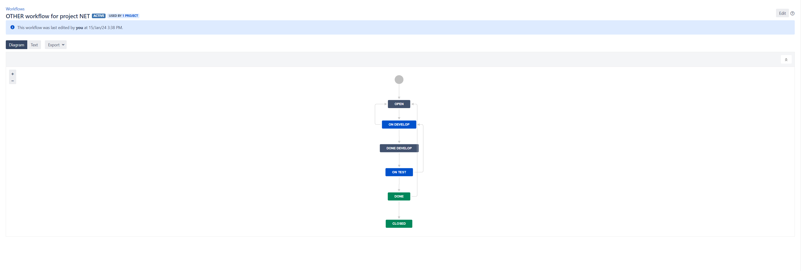
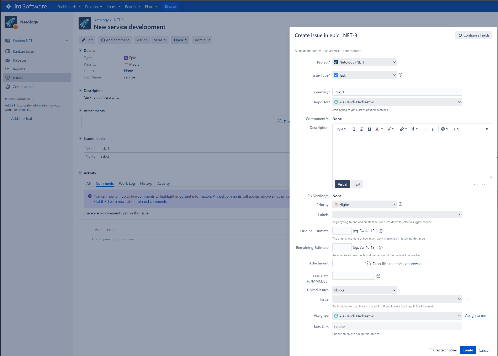
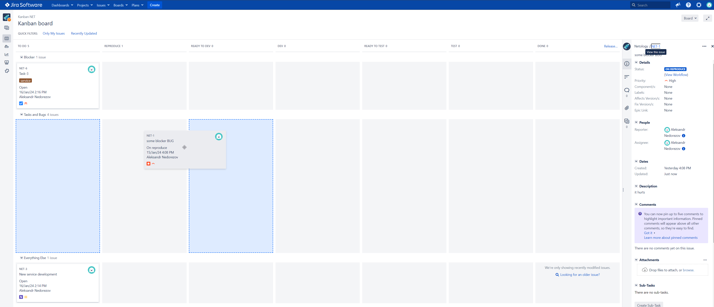
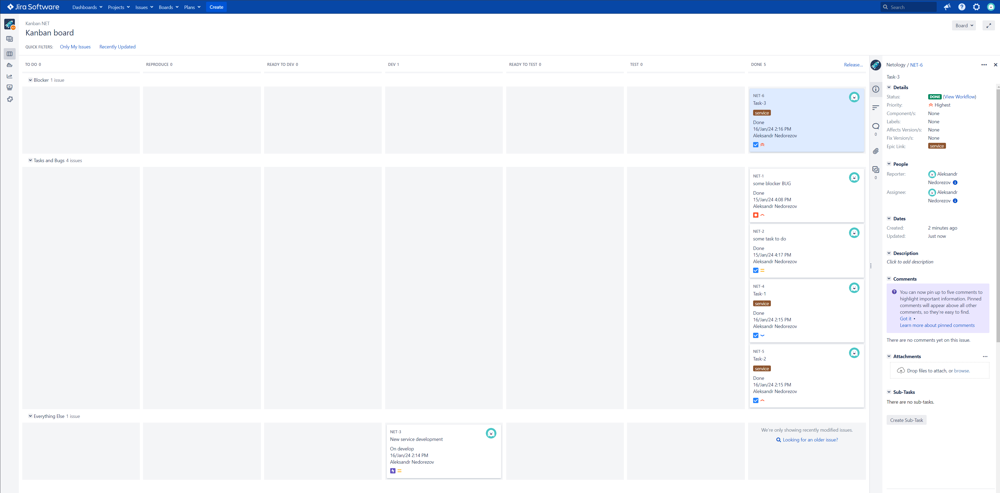
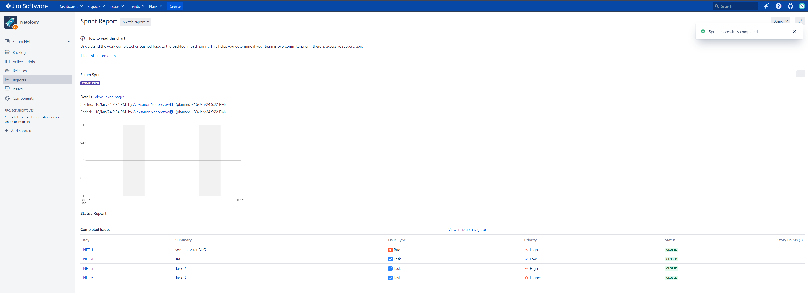

# Домашнее задание к занятию "Жизненный цикл ПО"

------

## Подготовка к выполнению

1. Получить бесплатную версию Jira - https://www.atlassian.com/ru/software/jira/work-management/free (скопируйте ссылку в адресную строку). 
Вы можете воспользоваться любым(в том числе бесплатным vpn сервисом) если сайт у вас недоступен. Кроме того вы можете скачать [docker образ](https://hub.docker.com/r/atlassian/jira-software/#) и запустить на своем хосте self-managed версию jira.
2. Настроить её для своей команды разработки.
3. Создать доски Kanban и Scrum.
4. [Дополнительные инструкции от разработчика Jira](https://support.atlassian.com/jira-cloud-administration/docs/import-and-export-issue-workflows/).

## Основная часть
> 
> Необходимо создать собственные workflow для двух типов задач: bug и остальные типы задач. Задачи типа bug должны проходить жизненный цикл:
> 
> 1. Open -> On reproduce.
> 2. On reproduce -> Open, Done reproduce.
> 3. Done reproduce -> On fix.
> 4. On fix -> On reproduce, Done fix.
> 5. Done fix -> On test.
> 6. On test -> On fix, Done.
> 7. Done -> Closed, Open.
> 
> Остальные задачи должны проходить по упрощённому workflow:
> 
> 1. Open -> On develop.
> 2. On develop -> Open, Done develop.
> 3. Done develop -> On test.
> 4. On test -> On develop, Done.
> 5. Done -> Closed, Open.
> 
> **Что нужно сделать**
> 
> 1. Создайте задачу с типом bug, попытайтесь провести его по всему workflow до Done. 
> 2. Создайте задачу с типом epic, к ней привяжите несколько задач с типом task, проведите их по всему workflow до Done. 
> 3. При проведении обеих задач по статусам используйте kanban. 
> 4. Верните задачи в статус Open.
> 5. Перейдите в Scrum, запланируйте новый спринт, состоящий из задач эпика и одного бага, стартуйте спринт, проведите задачи до состояния Closed. Закройте спринт.
> 6. Если всё отработалось в рамках ожидания — выгрузите схемы workflow для импорта в XML. Файлы с workflow и скриншоты workflow приложите к решению задания.

------

## Ответ:
Запустил JIRA в Docker через [docker-compose.yml](docker-compose.yml), получил триал-лицензию.
Создал проект Netology (NET), для него создал доски Scrum и Kanban

В `Administrations - Issues` создал 2 workflow для `bug` и `other`, а также workflow scheme:

BUG workflow ([XML-схема](workflow/BUG%20workflow%20for%20project%20NET.xml)):

OTHER workflow ([XML-схема](workflow/OTHER%20workflow%20for%20project%20NET.xml)):

Для Kanban настроил `columns` доски так, чтобы в обычной ситуации issues не двигались в обратном направлении, а также добавил `swimlanes` для выделения задач с высшим приоритетом:

Создал баг, эпик и таски в эпике, провел задачи по workflow до статуса `Done`:

Вернул все задачи в `Open`, в Scrum запланировал новый спринт с задачами эпика и багом:

Провел все задачи до статуса `Closed`, закрыл спринт успешно.

Отчет по спринту:

------
