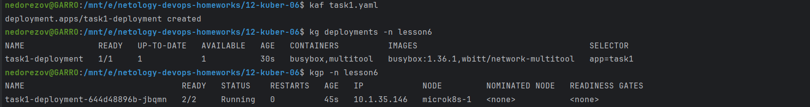
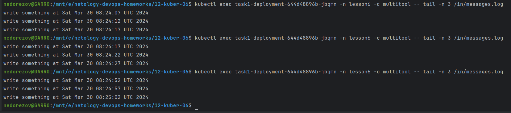
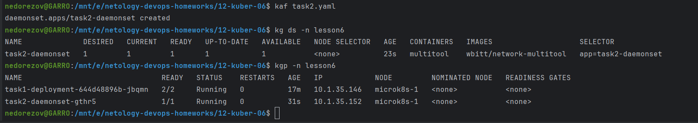
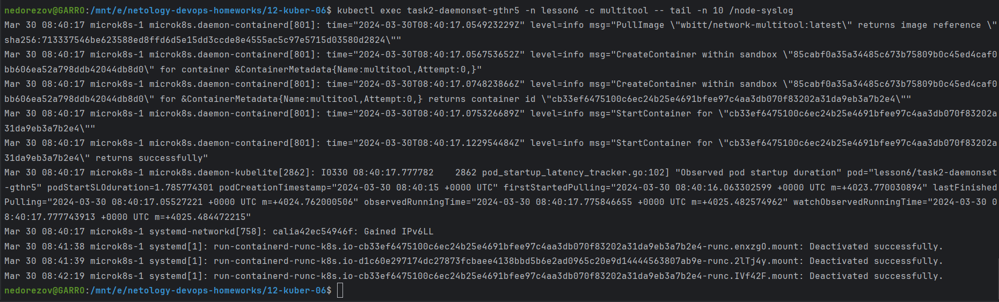

# Домашнее задание к занятию «Хранение в K8s. Часть 1»
## Студент: Александр Недорезов

### Цель задания

В тестовой среде Kubernetes нужно обеспечить обмен файлами между контейнерам пода и доступ к логам ноды.

------

Чеклист готовности к домашнему заданию

1. Установленное K8s-решение (например, MicroK8S).
2. Установленный локальный kubectl.
3. Редактор YAML-файлов с подключенным GitHub-репозиторием.

------

Дополнительные материалы для выполнения задания

1. [Инструкция по установке MicroK8S](https://microk8s.io/docs/getting-started).
2. [Описание Volumes](https://kubernetes.io/docs/concepts/storage/volumes/).
3. [Описание Multitool](https://github.com/wbitt/Network-MultiTool).

------

### Задание 1 

> **Что нужно сделать**
> 
> Создать Deployment приложения, состоящего из двух контейнеров и обменивающихся данными.
> 
> 1. Создать Deployment приложения, состоящего из контейнеров busybox и multitool.
> 2. Сделать так, чтобы busybox писал каждые пять секунд в некий файл в общей директории.
> 3. Обеспечить возможность чтения файла контейнером multitool.
> 4. Продемонстрировать, что multitool может читать файл, который периодически обновляется.
> 5. Предоставить манифесты Deployment в решении, а также скриншоты или вывод команды из п. 4.

### Решение:

Манифест: [task1.yaml](task1.yaml)

1. Volume `messages` (тип emptyDir) примонтирован в `busybox` в каталог /out, а в `multitool` в каталог /in
2. В `busybox` прописал выполнение команды `while true; do echo write something at $(date) >> /out/messages.log; sleep 5; done`
3. Применил конфигурацию, deployment с подами успешно создан:

4. Проверил из `multitool` доступность файла:

------

### Задание 2

> **Что нужно сделать**
> 
> Создать DaemonSet приложения, которое может прочитать логи ноды.
> 
> 1. Создать DaemonSet приложения, состоящего из multitool.
> 2. Обеспечить возможность чтения файла `/var/log/syslog` кластера MicroK8S.
> 3. Продемонстрировать возможность чтения файла изнутри пода.
> 4. Предоставить манифесты Deployment, а также скриншоты или вывод команды из п. 2.

### Решение:

Манифест: [task2.yaml](task2.yaml)

1. Применил конфигурацию, созданные объекты:

2. Проверим доступность `syslog` ноды, на которой запущен под DaemonSet:

------

### Правила приёма работы

1. Домашняя работа оформляется в своём Git-репозитории в файле README.md. Выполненное задание пришлите ссылкой на .md-файл в вашем репозитории.
2. Файл README.md должен содержать скриншоты вывода необходимых команд `kubectl`, а также скриншоты результатов.
3. Репозиторий должен содержать тексты манифестов или ссылки на них в файле README.md.

------