# Домашнее задание к занятию «Хранение в K8s. Часть 2»

### Цель задания

В тестовой среде Kubernetes нужно создать PV и продемонстрировать запись и хранение файлов.

------

Чеклист готовности к домашнему заданию

1. Установленное K8s-решение (например, MicroK8S).
2. Установленный локальный kubectl.
3. Редактор YAML-файлов с подключенным GitHub-репозиторием.

------

Дополнительные материалы для выполнения задания

1. [Инструкция по установке NFS в MicroK8S](https://microk8s.io/docs/nfs). 
2. [Описание Persistent Volumes](https://kubernetes.io/docs/concepts/storage/persistent-volumes/). 
3. [Описание динамического провижининга](https://kubernetes.io/docs/concepts/storage/dynamic-provisioning/). 
4. [Описание Multitool](https://github.com/wbitt/Network-MultiTool).

------

### Задание 1

> **Что нужно сделать**
> 
> Создать Deployment приложения, использующего локальный PV, созданный вручную.
> 
> 1. Создать Deployment приложения, состоящего из контейнеров busybox и multitool.
> 2. Создать PV и PVC для подключения папки на локальной ноде, которая будет использована в поде.
> 3. Продемонстрировать, что multitool может читать файл, в который busybox пишет каждые пять секунд в общей директории. 
> 4. Удалить Deployment и PVC. Продемонстрировать, что после этого произошло с PV. Пояснить, почему.
> 5. Продемонстрировать, что файл сохранился на локальном диске ноды. Удалить PV.  Продемонстрировать что произошло с файлом после удаления PV. Пояснить, почему.
> 6. Предоставить манифесты, а также скриншоты или вывод необходимых команд.

### Решение:

Deployment приложения и PVC: [task1.yaml](task1.yaml)
Вручную созданный Persistent Volume: [task1-pv.yaml](task1-pv.yaml)

1. Применил конфигурацию, успешно созданы объекты:
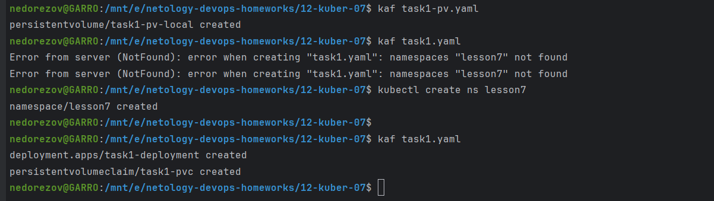
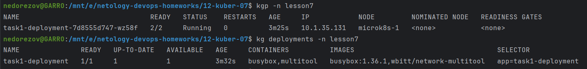
Видно, что pvc и pv в статусе Bound, т.е. связь произошла успешно:
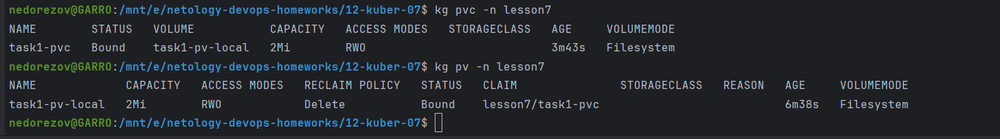

2. Проверил наличие файла локально на ноде:
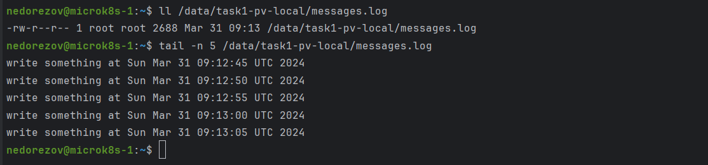
3. Также проверил, что multitool может читать файл:
 reclamation_):
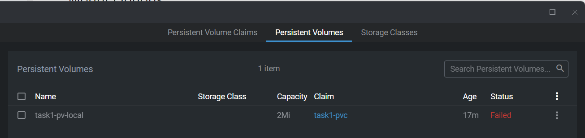
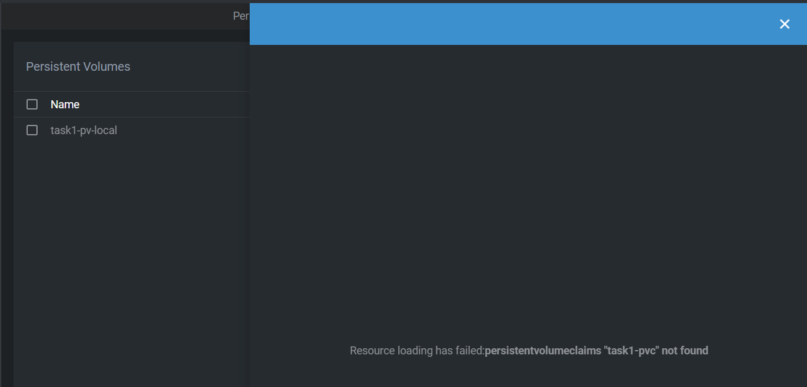
Причина в том, что hostPath provision не поддерживает `Delete` ReclaimPolicy. 
5. Файл на ноде сохранился, в том числе и после удаления PV, опять же по причине, что provision не поддерживает Delete. 
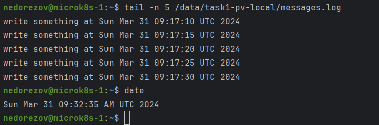
6. Для эксперимента изменил ReclaimPolicy на `Retain`. После удаления Deployment и PVC наш PV перешел в статус `Released`, т.е. запрос удален, но сам storage ожидает повторной привязки. (_the claim has been deleted, but the associated storage resource is not yet reclaimed by the cluster_), файл также остался на ноде.
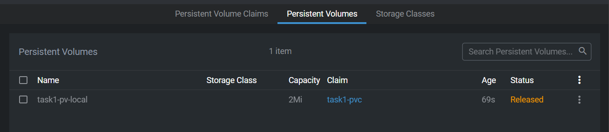
7. Для эксперимента изменил ReclaimPolicy на `Recycle` - именно эту политику следует применять для hostPath provision с целью удалять данные. Deployment и PVC удалил, после этого PV перешел в статус `Available`, т.е. не привязанный к запросу:
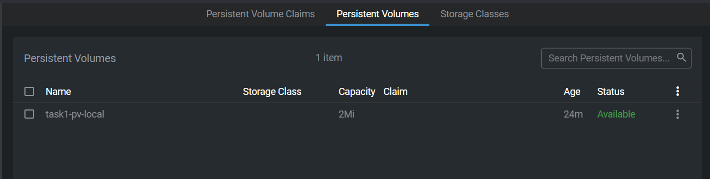
Файл с ноды также был удален:
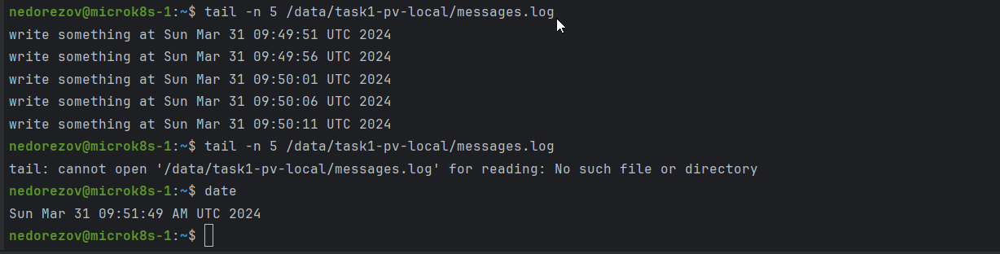

------

### Задание 2

> **Что нужно сделать**
> 
> Создать Deployment приложения, которое может хранить файлы на NFS с динамическим созданием PV.
> 
> 1. Включить и настроить NFS-сервер на MicroK8S.
> 2. Создать Deployment приложения состоящего из multitool, и подключить к нему PV, созданный автоматически на сервере NFS.
> 3. Продемонстрировать возможность чтения и записи файла изнутри пода. 
> 4. Предоставить манифесты, а также скриншоты или вывод необходимых команд.

### Решение:

Deployment и PVC: [task2.yaml](task2.yaml)

1. Выполнил `sudo microk8s enable nfs` и установил пакет `nfs-common`. В кластере появился StorageClass `nfs`:
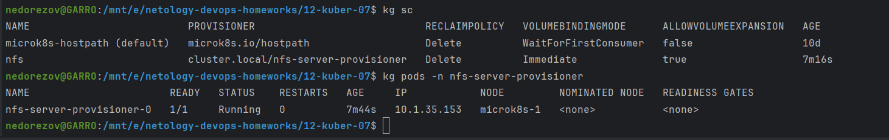
2. Применил созданный манифест. Видно, что создался динамический PV по запросу PVC с помощью nfs provision. Объекты в кластере:
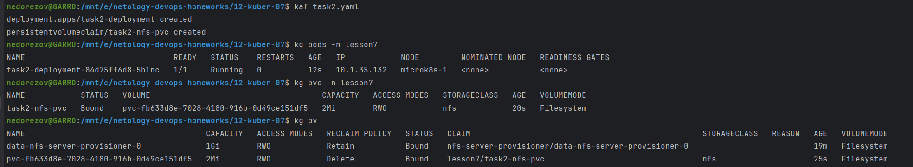
3. Проверил доступность чтения и записи изнутри пода в подключенном PV:
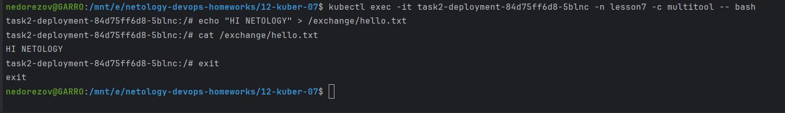

------

### Правила приёма работы

1. Домашняя работа оформляется в своём Git-репозитории в файле README.md. Выполненное задание пришлите ссылкой на .md-файл в вашем репозитории.
2. Файл README.md должен содержать скриншоты вывода необходимых команд `kubectl`, а также скриншоты результатов.
3. Репозиторий должен содержать тексты манифестов или ссылки на них в файле README.md.
