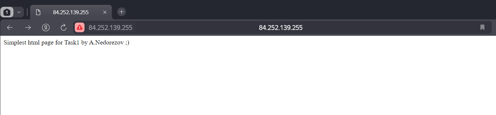

# Домашнее задание к занятию «Конфигурация приложений»
## Студент: Александр Недорезов

### Цель задания

В тестовой среде Kubernetes необходимо создать конфигурацию и продемонстрировать работу приложения.

------

Чеклист готовности к домашнему заданию

1. Установленное K8s-решение (например, MicroK8s).
2. Установленный локальный kubectl.
3. Редактор YAML-файлов с подключённым GitHub-репозиторием.

------

Дополнительные материалы для выполнения задания

1. [Описание](https://kubernetes.io/docs/concepts/configuration/secret/) Secret.
2. [Описание](https://kubernetes.io/docs/concepts/configuration/configmap/) ConfigMap.
3. [Описание](https://github.com/wbitt/Network-MultiTool) Multitool.

------

### Задание 1. Создать Deployment приложения и решить возникшую проблему с помощью ConfigMap. Добавить веб-страницу

> 1. Создать Deployment приложения, состоящего из контейнеров nginx и multitool.
> 2. Решить возникшую проблему с помощью ConfigMap.
> 3. Продемонстрировать, что pod стартовал и оба контейнера работают.
> 4. Сделать простую веб-страницу и подключить её к Nginx с помощью ConfigMap. Подключить Service и показать вывод curl или в браузере.
> 5. Предоставить манифесты, а также скриншоты или вывод необходимых команд.

### Решение:

Манифест с Deployment, ConfigMap, Service и Ingress: [task1.yaml](task1.yaml)

1. В Deployment сразу учел конфликт портов, для `multitool` значение порта взято из ConfigMap через `env`, а для `nginx` страничка html примаплена из ConfigMap через `volume`  
  

2. Проверим доступность нашей index.html извне через браузер:  

------

### Задание 2. Создать приложение с вашей веб-страницей, доступной по HTTPS 

> 1. Создать Deployment приложения, состоящего из Nginx.
> 2. Создать собственную веб-страницу и подключить её как ConfigMap к приложению.
> 3. Выпустить самоподписанный сертификат SSL. Создать Secret для использования сертификата.
> 4. Создать Ingress и необходимый Service, подключить к нему SSL в вид. Продемонстрировать доступ к приложению по HTTPS. 
> 5. Предоставить манифесты, а также скриншоты или вывод необходимых команд.

### Решение:

Манифест: [task2.yaml](task2.yaml)

1. Для генерации сертификата написал скрипт [genkey.sh](genkey.sh), который генерирует корневой ключ с сертом, затем создает запрос на выпуск сертификата на домен `microk8s.nedorezov.ru` и подписывает корневым.
2. Взял за основу манифест из задания 1, изменил `ConfigMap`, убрал Multitool, перенастроил `Service`. Добавил в `Ingress` блок с настройкой TLS, а также Secret с данными сгенерированного нами ключа.
3. Применил конфигурацию:  

4. Проверил доступность приложения, добавив запись с ip и доменом в Hosts. Также посмотрел, что TLS построен на нашем выпущенном ключе, а не стандартном "fake" от ingress controller-а:  

------

### Правила приёма работы

1. Домашняя работа оформляется в своём GitHub-репозитории в файле README.md. Выполненное домашнее задание пришлите ссылкой на .md-файл в вашем репозитории.
2. Файл README.md должен содержать скриншоты вывода необходимых команд `kubectl`, а также скриншоты результатов.
3. Репозиторий должен содержать тексты манифестов или ссылки на них в файле README.md.

------