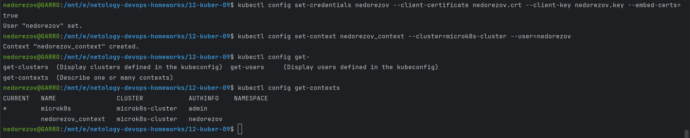
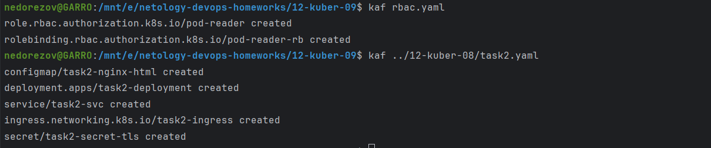

# Домашнее задание к занятию «Управление доступом»
## Студент: Александр Недорезов

### Цель задания

В тестовой среде Kubernetes нужно предоставить ограниченный доступ пользователю.

------

Чеклист готовности к домашнему заданию

1. Установлено k8s-решение, например MicroK8S.
2. Установленный локальный kubectl.
3. Редактор YAML-файлов с подключённым github-репозиторием.

------

Дополнительные материалы для выполнения задания

1. [Описание](https://kubernetes.io/docs/reference/access-authn-authz/rbac/) RBAC.
2. [Пользователи и авторизация RBAC в Kubernetes](https://habr.com/ru/company/flant/blog/470503/).
3. [RBAC with Kubernetes in Minikube](https://medium.com/@HoussemDellai/rbac-with-kubernetes-in-minikube-4deed658ea7b).

------

### Задание 1. Создайте конфигурацию для подключения пользователя

> 1. Создайте и подпишите SSL-сертификат для подключения к кластеру.
> 2. Настройте конфигурационный файл kubectl для подключения.
> 3. Создайте роли и все необходимые настройки для пользователя.
> 4. Предусмотрите права пользователя. Пользователь может просматривать логи подов и их конфигурацию (`kubectl logs pod <pod_id>`, `kubectl describe pod <pod_id>`).
> 5. Предоставьте манифесты и скриншоты и/или вывод необходимых команд.

### Решение:

Запрос на подписание сертификата: [request.yaml](request.yaml)
Роль и привязка к пользователю: [rbac.yaml](rbac.yaml)

1. Сгенерировал ключ и запрос на выпуск сертификата:  

2. Добавил csr в манифест и применил его, далее с помощью `kubectl` под админом подписал запрос и выгрузил серт:  

3. Создал пользователя и контекст в конфигурации `kubectl` с этим сертификатом:

4. Применил конфигурацию [rbac.yaml](rbac.yaml) с ролью и привязкой роли к пользователю. Для дальнейшей проверки доступа повторно создал объекты из прошлого д/з.
Пользователь имеет доступ к "describe" подов и их логов в `namespace=lesson8`, т.е. `get` и `watch`.  

5. Переключился в созданный контекст и проверил наличие доступа. 
Получилось выполнить describe пода с nginx в нужном namespace, а также прочитать логи этого пода, где видно подключение к приложению.   

6. Также проверил, что к другим ресурсам доступа нет:  

------

### Правила приёма работы

1. Домашняя работа оформляется в своём Git-репозитории в файле README.md. Выполненное домашнее задание пришлите ссылкой на .md-файл в вашем репозитории.
2. Файл README.md должен содержать скриншоты вывода необходимых команд `kubectl`, скриншоты результатов.
3. Репозиторий должен содержать тексты манифестов или ссылки на них в файле README.md.

------

