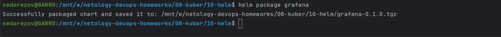
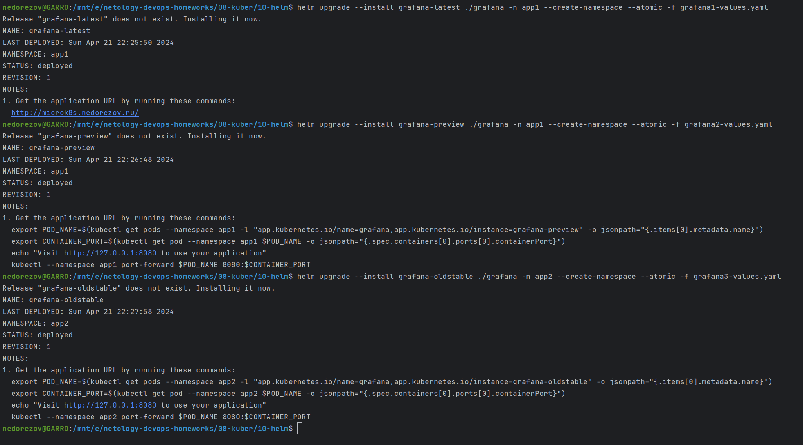
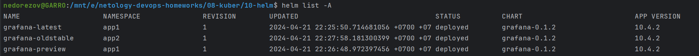
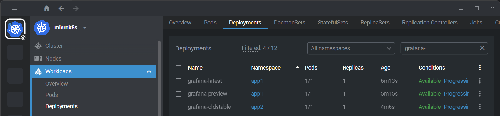
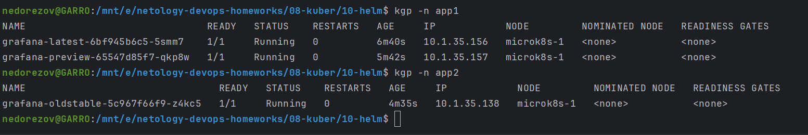
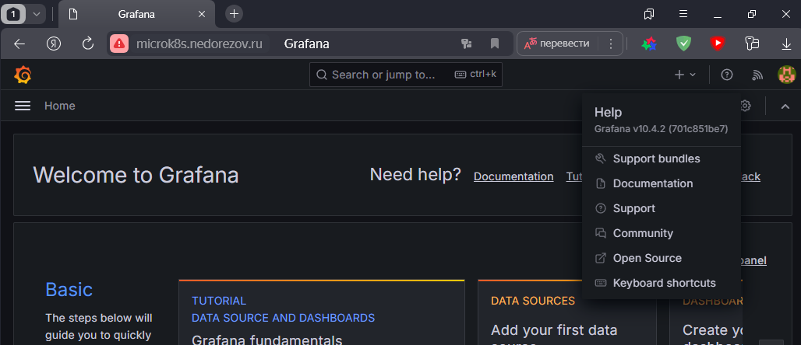
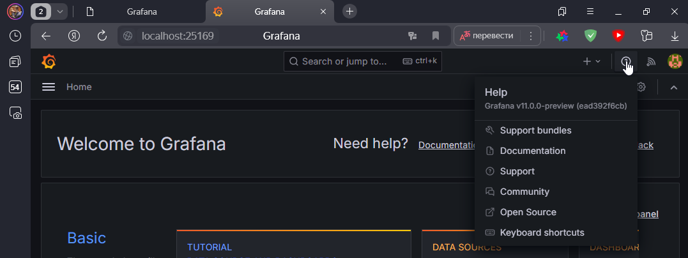

# Домашнее задание к занятию «Helm»

### Цель задания

В тестовой среде Kubernetes необходимо установить и обновить приложения с помощью Helm.

------

### Чеклист готовности к домашнему заданию

1. Установленное k8s-решение, например, MicroK8S.
2. Установленный локальный kubectl.
3. Установленный локальный Helm.
4. Редактор YAML-файлов с подключенным репозиторием GitHub.

------

### Инструменты и дополнительные материалы, которые пригодятся для выполнения задания

1. [Инструкция](https://helm.sh/docs/intro/install/) по установке Helm. [Helm completion](https://helm.sh/docs/helm/helm_completion/).

------

### Задание 1. Подготовить Helm-чарт для приложения

> 1. Необходимо упаковать приложение в чарт для деплоя в разные окружения. 
> 2. Каждый компонент приложения деплоится отдельным deployment’ом или statefulset’ом.
> 3. В переменных чарта измените образ приложения для изменения версии.

### Решение:

Упаковал приложение Grafana в Helm-chart. В чарте grafana запускается в deployment, предусмотрены persistence и ingress.

Готовый chart: [/grafana/values.yaml](grafana/values.yaml)  
Package: [grafana-0.1.3.tgz](grafana-0.1.3.tgz)

По умолчанию версия 10.4.2 (latest), но можно переопределить через values.

------

### Задание 2. Запустить две версии в разных неймспейсах

> 1. Подготовив чарт, необходимо его проверить. Запустите несколько копий приложения.
> 2. Одну версию в namespace=app1, вторую версию в том же неймспейсе, третью версию в namespace=app2.
> 3. Продемонстрируйте результат.

### Решение:

Для разных версий подготовил файлы с переменными: 
[app1](grafana1-values.yaml), [app2](grafana2-values.yaml), [app3](grafana3-values.yaml)

Установка выполнена успешно:

Список чартов:

Просмотр запущенных Deployments через Lens:

Список подов:

Проверил доступность latest-версии через ingress:

Также проверил preview-версию через port-forward:

------

### Правила приёма работы

1. Домашняя работа оформляется в своём Git репозитории в файле README.md. Выполненное домашнее задание пришлите ссылкой на .md-файл в вашем репозитории.
2. Файл README.md должен содержать скриншоты вывода необходимых команд `kubectl`, `helm`, а также скриншоты результатов.
3. Репозиторий должен содержать тексты манифестов или ссылки на них в файле README.md.
