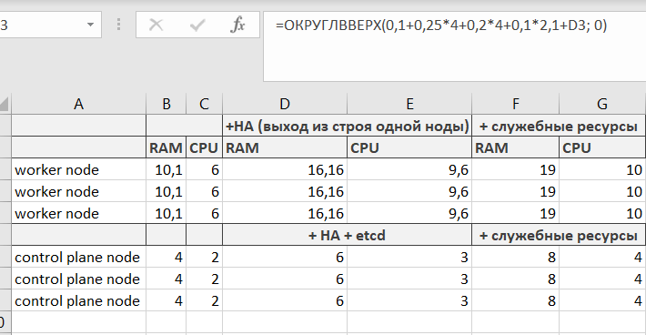

# Домашнее задание к занятию «Компоненты Kubernetes»
## Студент: Александр Недорезов

### Цель задания

Рассчитать требования к кластеру под проект

------

### Инструменты и дополнительные материалы, которые пригодятся для выполнения задания:

- [Considerations for large clusters](https://kubernetes.io/docs/setup/best-practices/cluster-large/),
- [Architecting Kubernetes clusters — choosing a worker node size](https://learnk8s.io/kubernetes-node-size).

------

### Задание. Необходимо определить требуемые ресурсы
> Известно, что проекту нужны база данных, система кеширования, а само приложение состоит из бекенда и фронтенда. Опишите, какие ресурсы нужны, если известно:
> 
> 1. Необходимо упаковать приложение в чарт для деплоя в разные окружения. 
> 2. База данных должна быть отказоустойчивой. Потребляет 4 ГБ ОЗУ в работе, 1 ядро. 3 копии. 
> 3. Кеш должен быть отказоустойчивый. Потребляет 4 ГБ ОЗУ в работе, 1 ядро. 3 копии. 
> 4. Фронтенд обрабатывает внешние запросы быстро, отдавая статику. Потребляет не более 50 МБ ОЗУ на каждый экземпляр, 0.2 ядра. 5 копий. 
> 5. Бекенд потребляет 600 МБ ОЗУ и по 1 ядру на копию. 10 копий.

### Решение:

В нашем кластере будет мало сервисов и подов, с нагрузкой может справиться и одна нода. 
Но для HA нужно:
- минимум 3 worker-ноды, в таком случае при потере ноды мы не потеряем слишком много подов и не развалим сервисы.
- 3 master-ноды, также можно на каждой из них развернуть etcd, вместо отдельного кластера для него.

Выполним расчет ресурсов, потребляемых сервисами:

| Сервис      | Реплики |  RAM |   CPU | RAM всего (Гб) | CPU всего |
|-------------|:-------:|-----:|------:|---------------:|----------:|
| База данных |    3    |    4 |     1 |             12 |         3 |
| Кэш         |    3    |    4 |     1 |             12 |         3 |
| Фронтенд    |    5    | 0,05 |   0,2 |           0,25 |         1 |
| Бэкенд      |   10    |  0,6 |     1 |              6 |        10 |
|             |         |      | Всего |      **30,25** |    **17** |

Теперь сделаем расчет необходимых ресурсов для кластера.
При расчете запаса на HA учел, что т.к. поды по воркерам будут распределены не равномерно, то нужно запасти ресурсов при вероятном отказе большей части подов. В среднем получилось + 50-60%.  
При расчете запаса на служебные ресурсы для worker-нод ориентировался на 
[статью](https://learnk8s.io/kubernetes-node-size#reserved-resource-in-kubernetes-worker-nodes), чтобы учесть ОС, kubelet и добавить threshold.  

Итого: 
- 3 control plane nodes с etcd, ресурсы 8 RAM + 4 CPU
- 3 worker nodes с 19 RAM и 10 CPU

----

### Правила приёма работы

1. Домашняя работа оформляется в своем Git-репозитории в файле README.md. Выполненное домашнее задание пришлите ссылкой на .md-файл в вашем репозитории.
2. Сначала сделайте расчёт всех необходимых ресурсов.
3. Затем прикиньте количество рабочих нод, которые справятся с такой нагрузкой.
4. Добавьте к полученным цифрам запас, который учитывает выход из строя как минимум одной ноды. 
5. Добавьте служебные ресурсы к нодам. Помните, что для разных типов нод требовния к ресурсам разные. 
6. В результате должно быть указано количество нод и их параметры.

