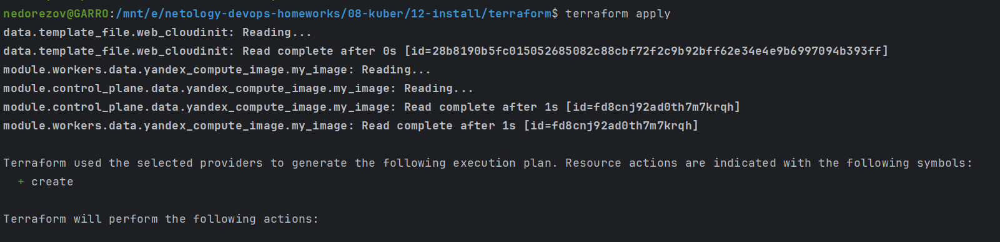
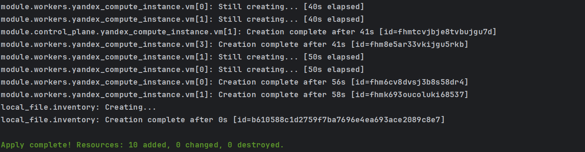
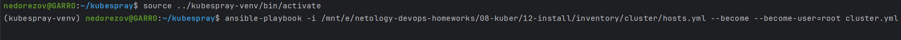
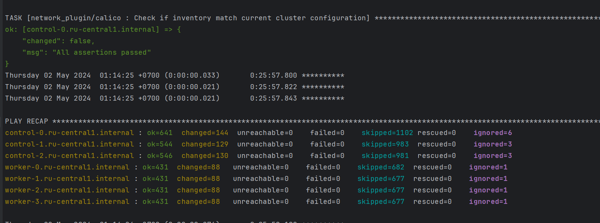
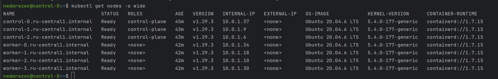
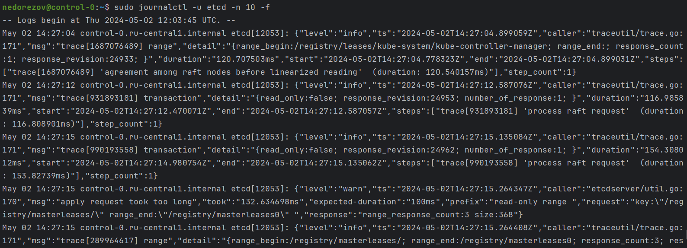
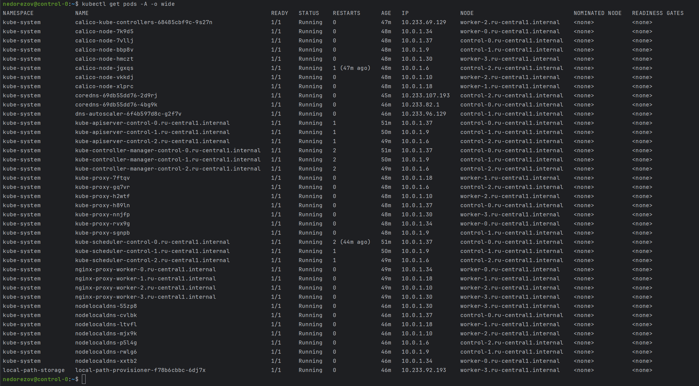

# Домашнее задание к занятию «Установка Kubernetes»
## Студент: Александр Недорезов

### Цель задания

Установить кластер K8s.

### Чеклист готовности к домашнему заданию

1. Развёрнутые ВМ с ОС Ubuntu 20.04-lts.


### Инструменты и дополнительные материалы, которые пригодятся для выполнения задания

1. [Инструкция по установке kubeadm](https://kubernetes.io/docs/setup/production-environment/tools/kubeadm/create-cluster-kubeadm/).
2. [Документация kubespray](https://kubespray.io/).

-----

### Задание 1. Установить кластер k8s с 1 master node

> 1. Подготовка работы кластера из 5 нод: 1 мастер и 4 рабочие ноды.
> 2. В качестве CRI — containerd.
> 3. Запуск etcd производить на мастере.
> 4. Способ установки выбрать самостоятельно.

------
### Задание 2*. Установить HA кластер

> 1. Установить кластер в режиме HA.
> 2. Использовать нечётное количество Master-node.
> 3. Для cluster ip использовать keepalived или другой способ.


### Решение:

Так как мы ранее уже поднимали кластер с помощью `kubeadm`, решил познакомиться с инструментом `kubespray` и поднять HA кластер на виртуалках в Yandex Cloud.

#### ВМ и Terraform
Для создания ВМ и остальных ресурсов использовал Terraform. ([./terraform/](terraform)).
Манифестами создаем 3 ноды `control`, а также 4 ноды `worker`, все параметры регулируются переменными в [variables.tf](terraform/variables.tf).\

Также terraform генерирует файл `hosts.yml` в нужном формате для kubespray, по шаблону [inventory.tftpl](terraform/inventory.tftpl)

Результат создания инфраструктуры:



#### Kubespray
Подготовил необходимое окружение для kubespray по официальной документации. Для запуска плейбука будем использовать ранее сгенерированный `hosts.yml`.

Также необходимо изменить параметры кластера для плейбука `kubespray` под наше окружение. Каталог с параметрами находится в [./inventory/](inventory).  
Из важного, что стоит отдельно упомянуть:
1.  Настроил локальный loadbalancer на нодах, чтобы распределять запросы по control-plane нодам.  
    Это самый простой способ, т.к. Yandex Cloud vrrp не поддерживает, а значит, keepalived и kube-vip не взлетят (пробовал).   
    Для этих целей в YC есть Network Load Balancer и Application Load Balancer, но NLB блокирует обращение ноды самой к себе (что бракует 33% трафика и ломает Join master-нод), а ALB сложно настроить сразу в процессе раскатки кластера, т.к. по порту 6443 нужно подсоединяться с TLS, а серты генерируются в пайплайне. 
    Можно сначала установить кластер полностью, а затем поднимать ALB и перенастраивать трафик, но лучше уж тогда использовать Managed Kubernetes. Либо поднимать на bare-metal
    ```yaml
    loadbalancer_apiserver_localhost: true
    loadbalancer_apiserver_type: nginx 
    loadbalancer_apiserver_port: 6443
    ```  
2. В качестве CRI — containerd
    ```yaml
    container_manager: containerd
    ```
3. etcd по умолчанию на мастер-нодах.

Активировал собранное окружение и запустил плейбук `kubespray`:

```shell
ansible-playbook -i /mnt/e/netology-devops-homeworks/08-kuber/12-install/inventory/cluster/hosts.yml --become --become-user=root cluster.yml
```

Установка выполнена успешно:


На ноде проверил состояние:
```shell
kubectl get nodes -o wide
```


ETCD работает без ошибок:


Также проверил поды:
```shell
kubectl get pods
```


