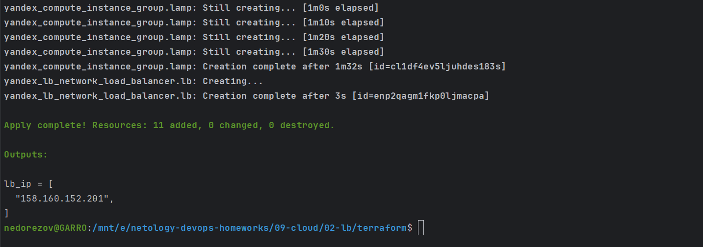
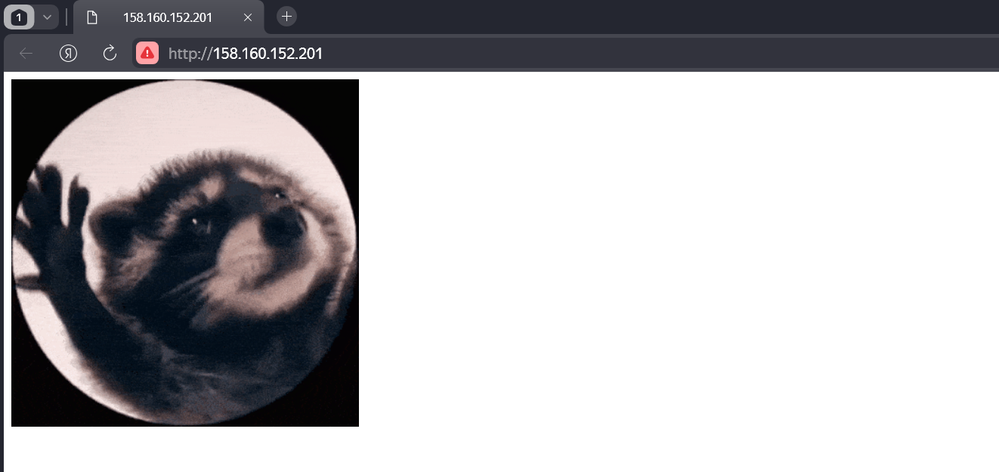
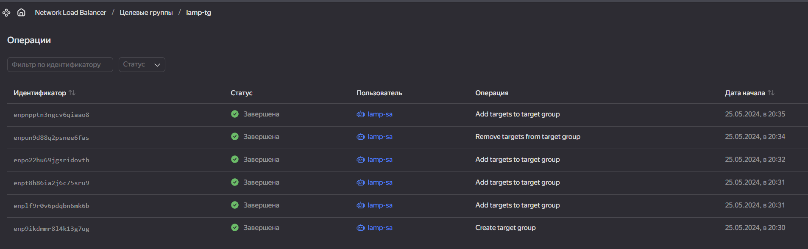

# Домашнее задание к занятию «Вычислительные мощности. Балансировщики нагрузки»  
## Студент: Александр Недорезов

### Подготовка к выполнению задания

1. Домашнее задание состоит из обязательной части, которую нужно выполнить на провайдере Yandex Cloud, и дополнительной части в AWS (выполняется по желанию). 
2. Все домашние задания в блоке 15 связаны друг с другом и в конце представляют пример законченной инфраструктуры.  
3. Все задания нужно выполнить с помощью Terraform. Результатом выполненного домашнего задания будет код в репозитории. 
4. Перед началом работы настройте доступ к облачным ресурсам из Terraform, используя материалы прошлых лекций и домашних заданий.

---
## Задание 1. Yandex Cloud 

> **Что нужно сделать**
> 
> 1. Создать бакет Object Storage и разместить в нём файл с картинкой:
>  - Создать бакет в Object Storage с произвольным именем (например, _имя_студента_дата_).
>  - Положить в бакет файл с картинкой.
>  - Сделать файл доступным из интернета.
>  
> 2. Создать группу ВМ в public подсети фиксированного размера с шаблоном LAMP и веб-страницей, содержащей ссылку на картинку из бакета:
>  - Создать Instance Group с тремя ВМ и шаблоном LAMP. Для LAMP рекомендуется использовать `image_id = fd827b91d99psvq5fjit`.
>  - Для создания стартовой веб-страницы рекомендуется использовать раздел `user_data` в [meta_data](https://cloud.yandex.ru/docs/compute/concepts/vm-metadata).
>  - Разместить в стартовой веб-странице шаблонной ВМ ссылку на картинку из бакета.
>  - Настроить проверку состояния ВМ.
>  
> 3. Подключить группу к сетевому балансировщику:
>  - Создать сетевой балансировщик.
>  - Проверить работоспособность, удалив одну или несколько ВМ.
> 
> 4. (дополнительно)* Создать Application Load Balancer с использованием Instance group и проверкой состояния.
> 
> Полезные документы:
> 
> - [Compute instance group](https://registry.terraform.io/providers/yandex-cloud/yandex/latest/docs/resources/compute_instance_group).
> - [Network Load Balancer](https://registry.terraform.io/providers/yandex-cloud/yandex/latest/docs/resources/lb_network_load_balancer).
> - [Группа ВМ с сетевым балансировщиком](https://cloud.yandex.ru/docs/compute/operations/instance-groups/create-with-balancer).

### Решение:

С помощью Terraform развернул все необходимые ресурсы в Yandex Cloud [terraform/](terraform)
- в [variables.tf](terraform/variables.tf) объявлены переменные с параметрами для всех объектов, объединены в map-ы для удобства. Сами значения (только публичные) заданы в [public.auto.tfvars](terraform/public.auto.tfvars).
Переменными настраиваются параметры VPC, Instance Group и Storage с объектом. Сам объект располагается в [terraform/files/tenor.gif](terraform/files/tenor.gif);
- в [network.tf](terraform/network.tf) описано создание `VPC`, `subnets`, а также `load balancer`;
- в [main.tf](terraform/main.tf) описано создание шаблона `cloud-init`, получение `image` id, а также создание `Instance Group` и сервисного аккаунта для него;
- в [storage.tf](terraform/storage.tf) создается `bucket`, сервисный аккаунт для управления и размещается `object`.

Выполнил `terraform apply`:

В output получил IP сетевого балансировщика, проверил доступность:

Попробовал остановить одну из ВМ, доступность ресурса не прервалась. На балансировщике видно состояние таргетов в группе:

Затем она полностью исключилась из группы. Но при запуске ВМ повторно она добавилась в target group автоматически, это видно по истории операций:
