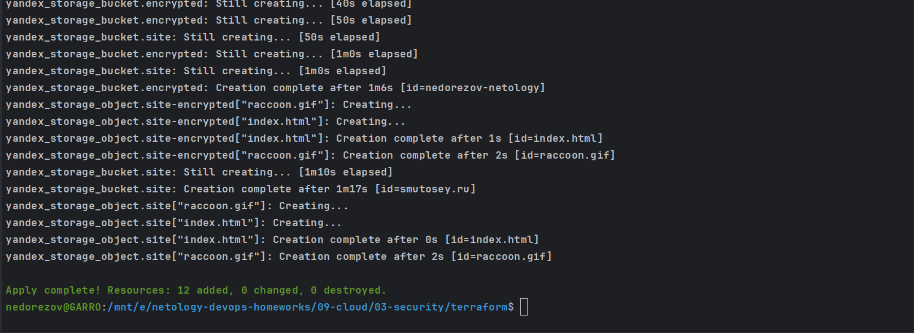
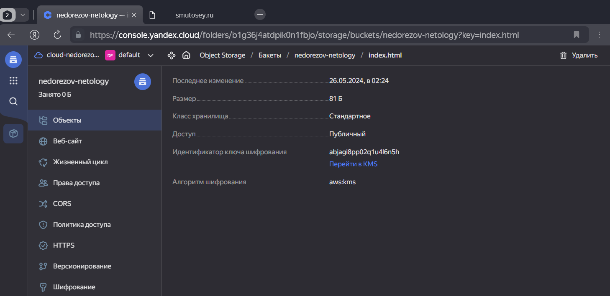
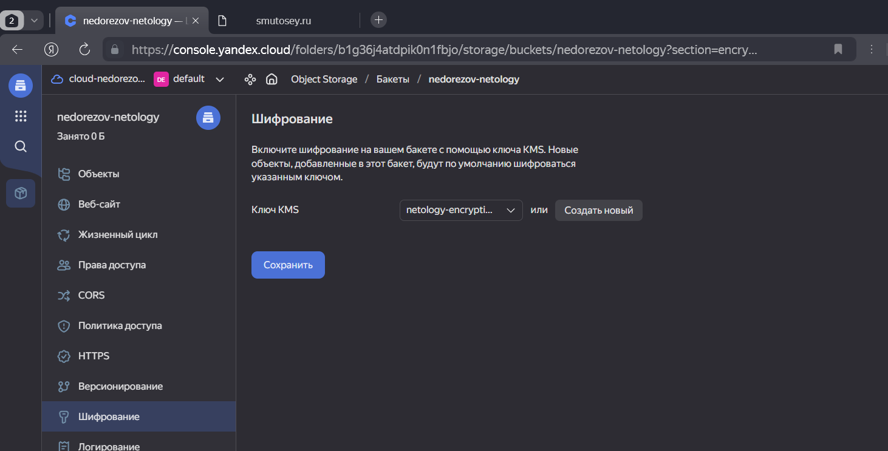
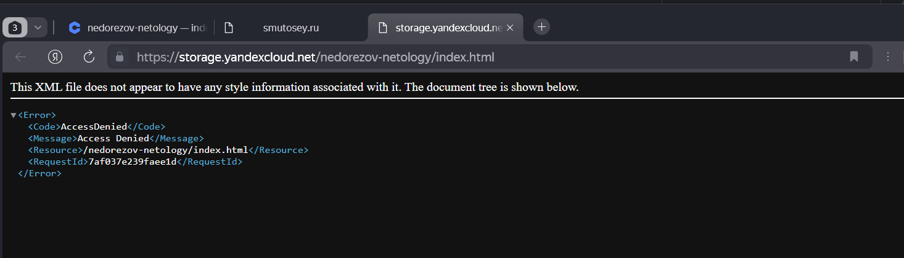
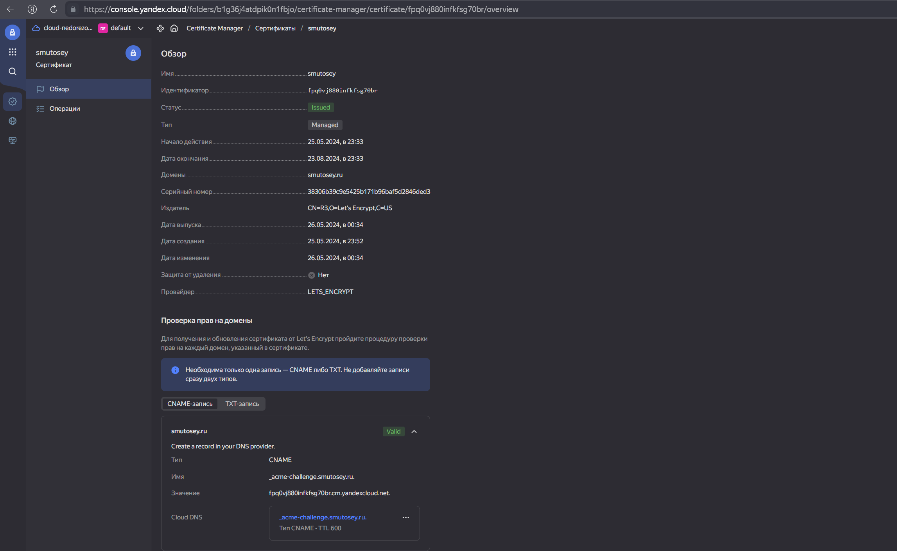
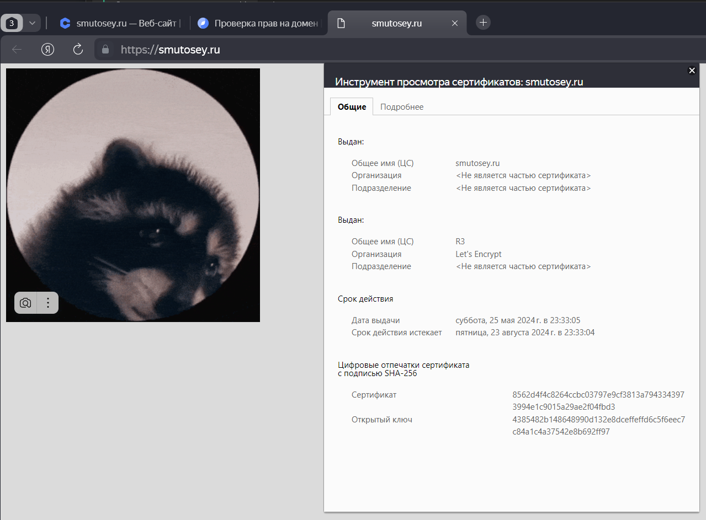

# Домашнее задание к занятию «Безопасность в облачных провайдерах»  
## Студент: Александр Недорезов

Используя конфигурации, выполненные в рамках предыдущих домашних заданий, нужно добавить возможность шифрования бакета.

---
## Задание 1. Yandex Cloud   

> 1. С помощью ключа в KMS необходимо зашифровать содержимое бакета:
> 
>  - создать ключ в KMS;
>  - с помощью ключа зашифровать содержимое бакета, созданного ранее.
>
> 2. (Выполняется не в Terraform)* Создать статический сайт в Object Storage c собственным публичным адресом и сделать доступным по HTTPS:
> 
>  - создать сертификат;
>  - создать статическую страницу в Object Storage и применить сертификат HTTPS;
>  - в качестве результата предоставить скриншот на страницу с сертификатом в заголовке (замочек).
> 
> Полезные документы:
> 
> - [Настройка HTTPS статичного сайта](https://cloud.yandex.ru/docs/storage/operations/hosting/certificate).
> - [Object Storage bucket](https://registry.terraform.io/providers/yandex-cloud/yandex/latest/docs/resources/storage_bucket).
> - [KMS key](https://registry.terraform.io/providers/yandex-cloud/yandex/latest/docs/resources/kms_symmetric_key).

### Решение:
С помощью Terraform развернул все необходимые ресурсы в Yandex Cloud [terraform/](terraform).

Выполнил `terraform apply`:

1. Дополнил бакет из прошлого задания, создал ключ KMS и зашифровал содержимое.
    
    
    Файл извне недоступен для прочтения:
    
---
2. Для выполнения 2 задания зарегистрировал домен, настроил у регистратора записи NS, выпустил в YC сертификат и подтвердил владение доменом:
    
    С помощью Terraform создал отдельный бакет для хостинга статического сайта, а также настроил https и хостинг автоматически.
    Проверил доступность и сертификат на сайте:
    